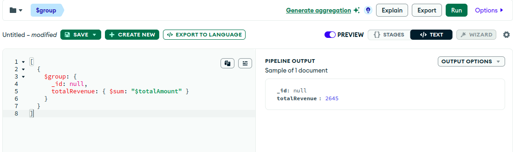
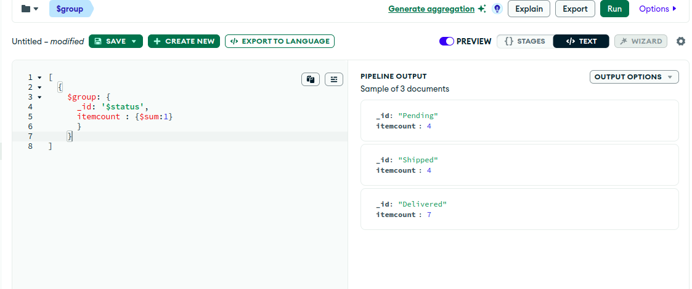
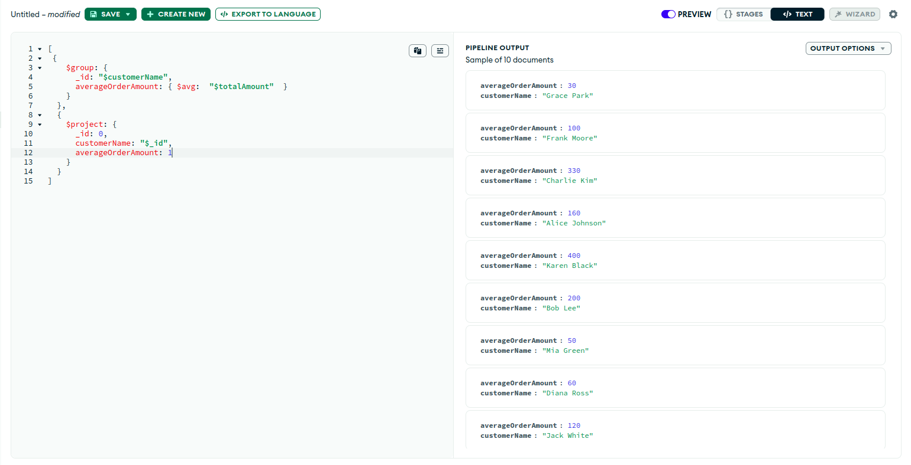
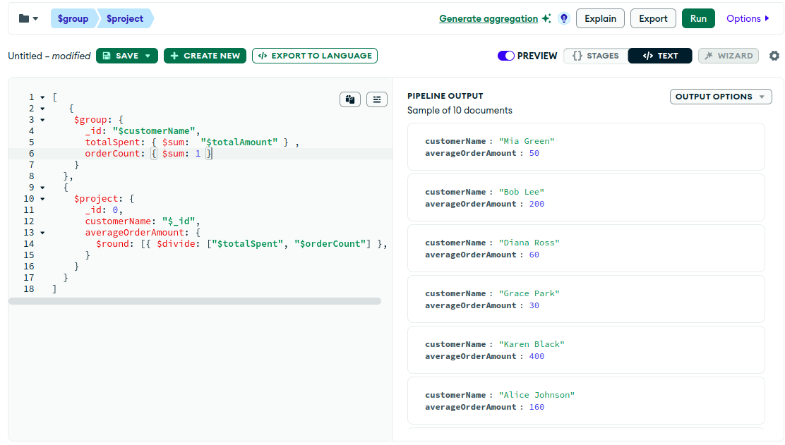
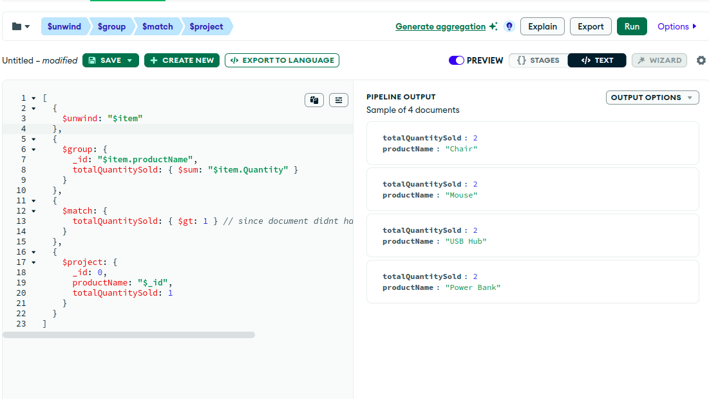
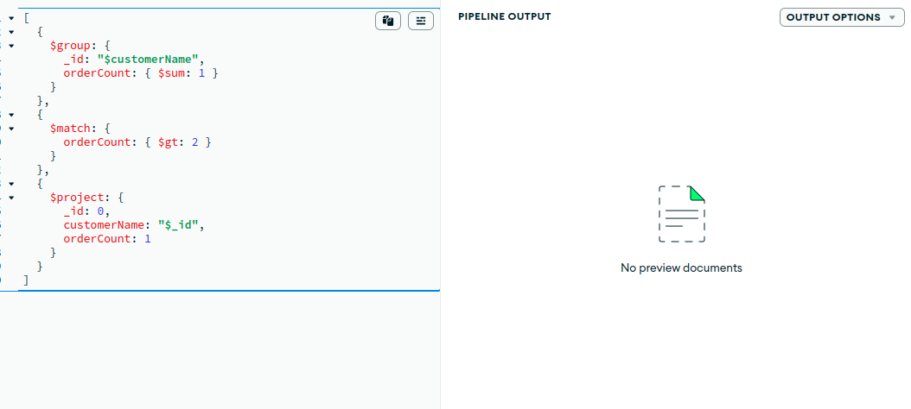
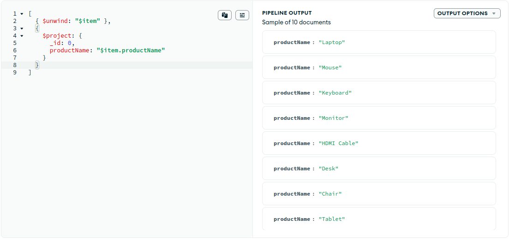
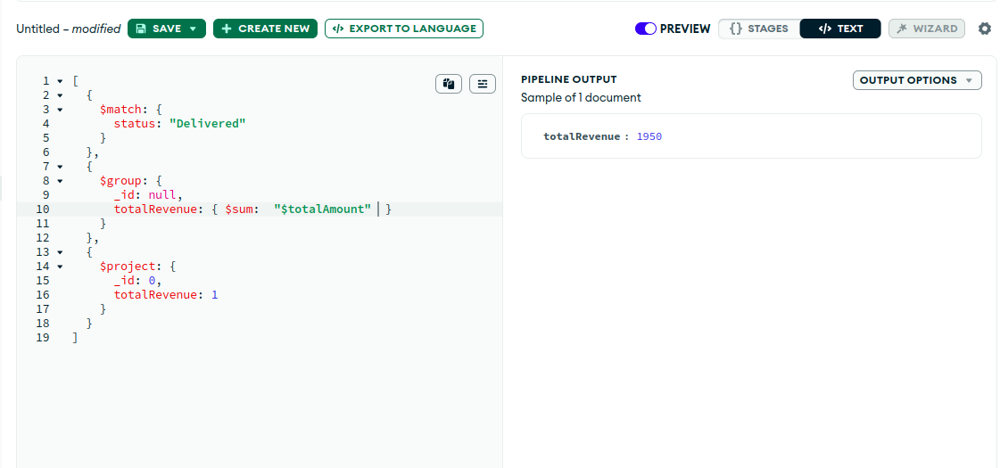
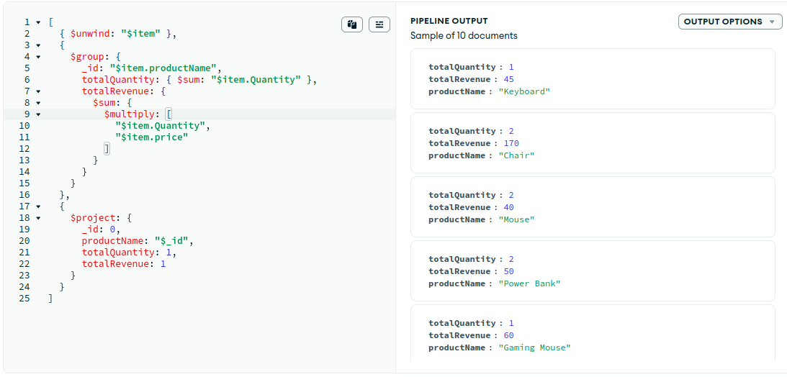

,
# MongoDB Aggregation Framework

## What is Aggregation?

Aggregation in MongoDB is a powerful way to process data and return computed results. It works by passing documents through a pipeline that transforms the data into an aggregated result.

## Aggregation Pipeline

The aggregation pipeline is a framework for data aggregation modeled on the concept of data processing pipelines. Documents enter a multi-stage pipeline that can transform them and output the aggregated result.

Each stage transforms the documents as they pass through the pipeline. Common stages include:

### 1. $match

Filters the documents to pass only the documents that match the specified condition(s).

```js
{
  $match: {
    status: "Delivered";
  }
}
```

### 2. $group

Groups input documents by a specified identifier expression and applies the accumulator expressions (like $sum, $avg, etc.)

```js
{
  $group: {
    _id: "$customerName",
    totalSpent: { $sum: "$totalAmount" }
  }
}
```
### 3. $project

Used to include, exclude, or add new fields.

```js
{
  $project: {
    productName: "$items.productName";
  }
}
```
### 4. $sort

Sorts all input documents and returns them to the pipeline in sorted order.

```js
{
  $sort: {
    totalAmount: -1;
  }
}
```
### 5. $limit

Limits the number of documents passed to the next stage.

```js
{
  $limit: 5;
}
```
### 6. $unwind

Deconstructs an array field from the input documents to output a document for each element.

```js
{
  $unwind: "$items";
}
```
## Example Use Cases

Calculating total revenue.
Finding top customers.
Listing monthly sales.
Analyzing product performance.

## Benefits

Simplifies complex data transformations.
Reduces need for multiple queries or application-side processing.
Increases performance for data analytics.

## Conclusion

MongoDB’s aggregation framework is an efficient and flexible way to perform data analysis directly within the database. By chaining multiple stages in a pipeline, you can extract meaningful insights and summaries from your data.

## Questions

# 1. Find total revenue generated (sum of totalAmount).

# 2. Find total number of orders by status (Pending, Shipped, Delivered).

# 3. Find the top 3 customers who spent the most (sort by totalAmount).

# 4. Get the average order amount per customer.

# 5. Find products that were sold more than 10 times (total quantity).

# 6. List monthly revenue (group by month-year) for the last 6 months.

# 7. Extract only the product names from all orders using $unwind and $project.

# 8. Apply filtering using $match (only Delivered orders) and then calculate revenue.

# 9. Calculate total quantity and total revenue per product (use $unwind and $group).
