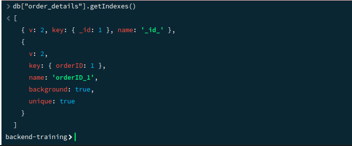
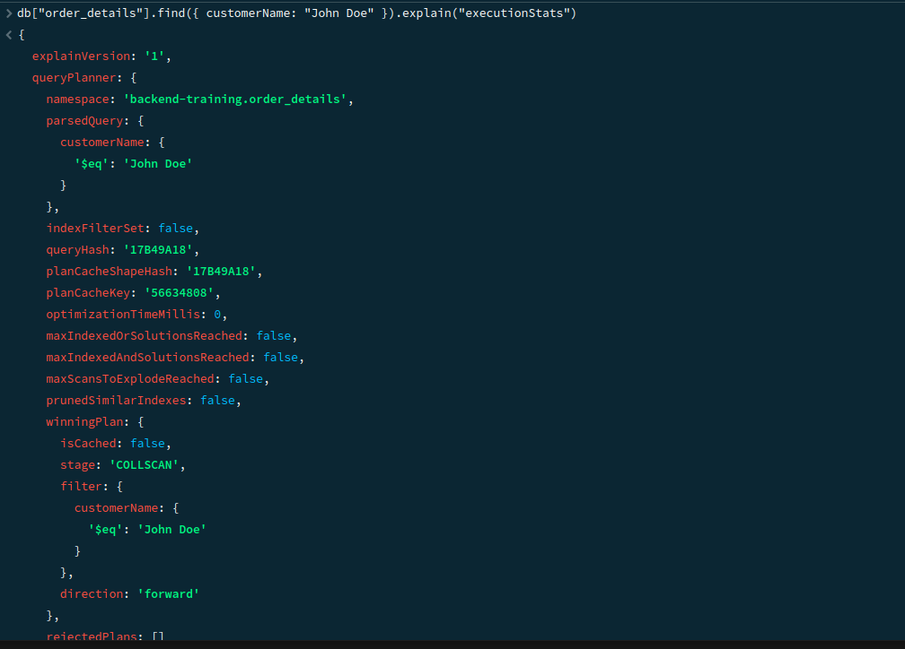
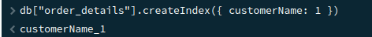
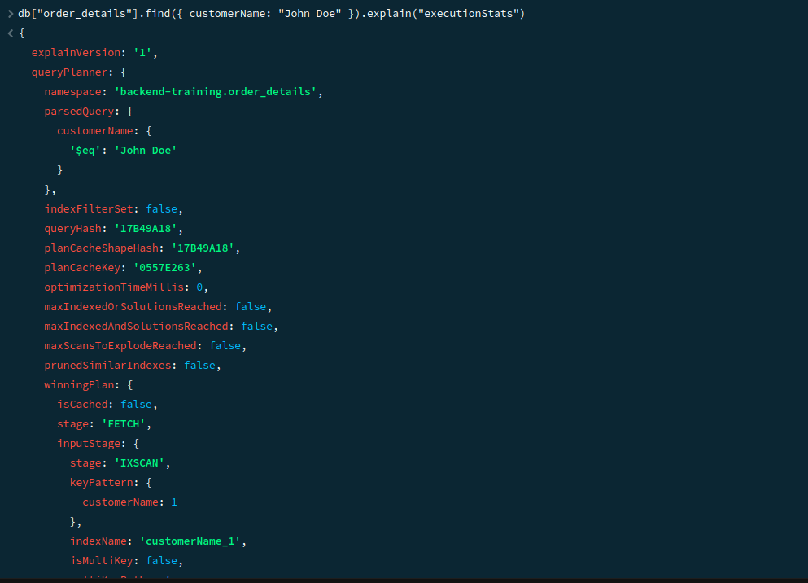
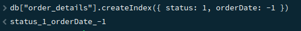
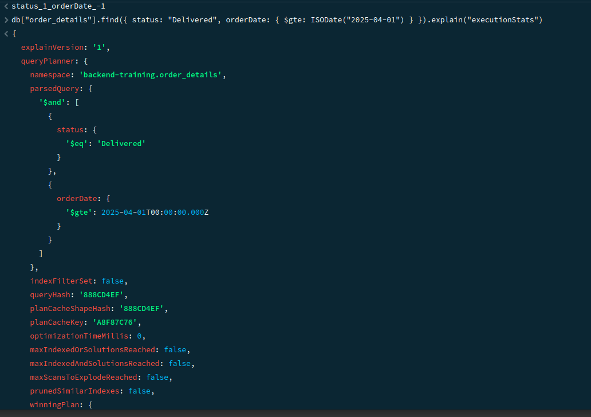

# 📦 MongoDB Indexing

## 📘 Overview

Indexing in MongoDB improves the efficiency of query operations by minimizing the number of documents MongoDB scans. Without indexes, MongoDB must scan every document in a collection to find the matching documents.

---

## 🛠️ Types of Indexes

1. **Single Field Index**  
   Created on a single field. Example: customerName

2. **Compound Index**  
   Created on multiple fields. Example: status + orderDate

3. **Text Index**  
   Allows text search on string content. Example: items.productName

4. **Hashed Index**  
   Supports sharding using hashed shard key.

---

## 📋 Basic Commands

### 🔍 Check Existing Indexes
``` js
db.collection.getIndexes()
```
### ➕ Create Index
```js
db.collection.createIndex({ fieldName: 1 }) // ascending
db.collection.createIndex({ fieldName: -1 }) // descending
```
### 🔁 Compound Index
```js
db.collection.createIndex({ status: 1, orderDate: -1 })
```
### 🔠 Text Index
```js
db.collection.createIndex({ "items.productName": "text" })
```
### 🗑️ Drop Index
```js
db.collection.dropIndex("indexName")
```
---

## ⚙️ Performance Check

### Use explain("executionStats") to compare query performance:
js
db.collection.find({ customerName: "John Doe" }).explain("executionStats")

---

## ✅ Best Practices

Index fields used in filters and sorting.
Avoid too many indexes—each write also updates the indexes.
Use compound indexes when filtering by multiple fields.
Use text indexes for search functionality.

## Questions

# 1. Check indexes on the collection.

# 2. Create an index on customerName. Run a query filtering by customerName and check performance using explain("executionStats").

# 3. Create a compound index on status and orderDate. Run a query filtering by bothand compare performance (before vs after).


# 4. Create a text index on items.productName. Perform a text search for a product.


# 5. Drop an index and observe performance difference.
